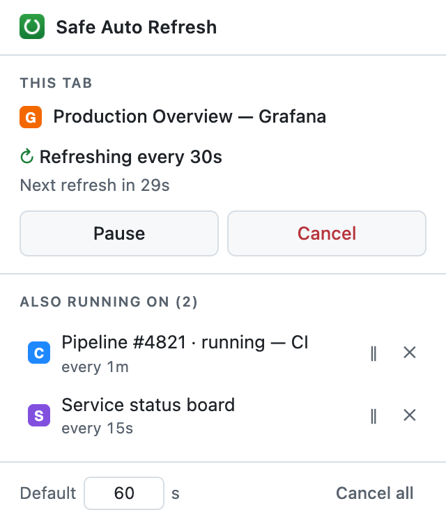

# Safe Auto Refresh & Page Reloader

A Chrome extension that reloads tabs on a timer — without asking for access to
a single web page.

No host permissions. No content scripts. No network calls. No telemetry. The
popup always tells you the truth about what is running, and every tab gets its
own independent job.

<p align="center">
  
</p>

## Why this exists

It replaces an earlier extension that was safe but broken. That one:

- showed a stateless popup that always read "Ready", whatever was actually running
- silently took over its single job slot when you pressed Start on a second tab
- declared a `storage` permission it never used
- shipped a README describing an architecture the code did not have
- silently stopped refreshing at intervals over 30 seconds, because its timers
  died with the service worker

This is a rewrite that fixes each of those, and has a test suite that proves it.

## What it does

- **Per-tab jobs.** Start a refresh on as many tabs as you like. Each has its
  own interval and its own pause/cancel. Starting one never disturbs another.
- **A popup that knows the truth.** Every time you open it, it reads live state
  from the service worker. Reopen it mid-run and it shows the running interval
  and a countdown to the next reload, not a hardcoded "Ready".
- **Visible state without opening anything.** A per-tab badge shows `↻` (green)
  while a tab is refreshing and `‖` (grey) while it is paused.
- **Other tabs at a glance.** The popup lists every other tab with a job, with
  pause/resume and cancel on each row. Click a row to jump to that tab.
- **Survives the service worker dying.** Chrome shuts down MV3 workers after
  ~30s idle. Jobs are re-armed from session state when the worker restarts.

## Install

Requires Chrome 120 or newer — that is the version where `chrome.alarms` gained
its 30-second minimum period, which the scheduler depends on.

### From source

1. `git clone https://github.com/langsys/chrome-extension-safe-auto-refresh.git`
2. Open `chrome://extensions`
3. Turn on **Developer mode**
4. **Load unpacked** → pick the repository folder

### From the Chrome Web Store

Not yet published. `npm run package` builds the reviewable zip.

## Permissions, and why each one is here

Three permissions, all of which Chrome installs without showing a warning
prompt. There are deliberately no host permissions, so the extension cannot
read or modify any page you visit.

| Permission | What it is used for |
| --- | --- |
| `alarms` | Scheduling reloads at intervals of 30s or more. Alarms are managed by Chrome, so they survive the service worker being shut down. |
| `storage` | `storage.session` holds live job state so it can be rebuilt after the worker restarts. `storage.local` holds exactly one preference: your default interval. |
| `activeTab` | Reading the title and favicon of the tab you press Start on, so the popup can label the job with something better than `Tab #4711`. Granted only for the tab you invoked the extension on, only at that moment. |

What is **not** in the manifest, and why it matters:

- **No `host_permissions`** — the extension cannot read, inject into, or modify
  any site. `chrome.tabs.reload()` needs no page access at all.
- **No `content_scripts`** — nothing of ours ever runs inside a page.
- **No `tabs` permission** — without it, tab URLs are invisible to the
  extension. It sees opaque numeric tab IDs and nothing else.
- **No `externally_connectable`** — no web page or other extension can send it
  messages.

## Privacy

The extension collects nothing, stores nothing about your browsing on disk, and
talks to no server. See [PRIVACY.md](PRIVACY.md) for the full statement.

Two things worth stating plainly rather than burying:

**Tab titles.** When you press Start, the title and favicon URL of that tab are
captured for the popup's job list. They live in `chrome.storage.session`, which
Chrome clears when the browser closes. They are never written to disk-durable
storage and never leave your machine.

**Favicons are real image loads.** The popup renders each job's favicon using
the URL the tab reports. When that is an `https://` URL, your browser fetches
it the same way it did to draw the tab strip — practically always from cache.
That is the only network request this extension can cause. It is not telemetry,
and nothing about you is sent anywhere, but "zero network activity, ever" would
be an overstatement, so we do not make it.

## How it works

### State

```js
// tabId -> { interval, state: 'running'|'paused', startedAt, lastRunAt, title, favIconUrl }
```

Held in a `Map` in the service worker and mirrored to `chrome.storage.session`
on every change. When Chrome restarts the worker, top-level code rehydrates from
that mirror, drops jobs whose tabs are gone, re-arms the rest, and repaints the
badges. That rehydrate step is what makes the popup trustworthy.

Session storage is cleared when the browser closes, so jobs deliberately do not
survive a browser restart.

### Scheduling

Chrome's alarms API has a 30-second floor, so scheduling is a hybrid:

- **Interval ≥ 30s** → `chrome.alarms`. Chrome owns the timer, so it keeps
  firing across worker shutdowns for free.
- **Interval < 30s** → `setInterval` in the worker. The reload calls themselves
  reset the worker's idle timer, so the loop mostly self-sustains — but if the
  worker dies anyway, a 30-second `keepalive` alarm wakes it, and rehydration
  re-arms the interval.

Without that keepalive, a fast job would silently stop the moment the worker
died. That is one of the bugs this extension exists to fix, so
[the test suite kills the worker mid-run and asserts recovery](test/e2e.mjs).

### Message protocol

The popup holds no scheduling logic. It sends a message, gets back the complete
job list, and re-renders:

`GET_STATE` · `START` · `PAUSE` · `RESUME` · `CANCEL` · `CANCEL_ALL` ·
`REFRESH_LABEL` · `SET_DEFAULT_INTERVAL`

Every message is checked to have come from this extension's own origin.

## Known limitations

These are real, and we would rather write them down than let you discover them.

- **Refresh follows the tab, not the URL.** Navigate a refreshing tab somewhere
  else and it keeps refreshing at the new address. Stopping automatically on
  navigation needs URL visibility we deliberately do not ask for, and our own
  reloads fire the same navigation events, so it is not something we can do
  reliably without the `tabs` permission. The badge is the mitigation: if a tab
  is refreshing, it says so.
- **Jobs do not survive a browser restart**, by design — runtime state lives in
  session storage. They also do not survive reloading or updating the extension.
- **A killed worker can cost you up to ~30s of a fast job.** The keepalive alarm
  cannot fire more often than every 30 seconds.
- **Minimum interval is 2 seconds.** Anything faster is closer to a denial of
  service against the site than a refresh.
- **Job titles go stale.** A label is captured when you press Start. It is
  refreshed whenever you open the popup on that tab, since that is the one tab
  whose title `activeTab` lets us read.

## Development

No build step, no dependencies, no bundler. Load the folder unpacked and edit.

```
manifest.json        MV3 manifest
background.js        service worker: jobs, scheduling, badges, persistence
popup.html/.css/.js  the popup UI
shared/constants.js  limits, message names and formatting shared by both sides
icons/               rasterized from assets/icon.svg
test/                end-to-end suite (see below)
scripts/package.sh   builds the Web Store zip
```

### Tests

```bash
npm test              # headless, ~3 minutes
npm run test:headful  # same, with a visible browser
```

The suite launches a real Chrome with the extension loaded, drives the real
popup-to-background message protocol, and counts requests arriving at a local
fixture server — so "it reloaded the tab" is measured, not assumed. It covers
scheduling on both the alarm and interval paths, pause/resume, multi-tab
independence, service-worker death and recovery, tab-close cleanup, badge
states, input validation and cancel-all.

> Chrome 137+ ships a kill switch for the `--load-extension` command line flag,
> and on current stable it stays off even when the feature is disabled. The
> harness therefore prefers a **Chrome for Testing** build (the one Playwright
> downloads) and falls back to system Chrome. Override with `CHROME_PATH`.

### Icons

`assets/icon.svg` is the source. Regenerate with:

```bash
npm run icons   # needs rsvg-convert (brew install librsvg)
```

### Releasing

Tagging a version runs the test suite, builds the zip, uploads it to the Chrome
Web Store as a draft, and creates a GitHub release:

```bash
git tag v1.0.1 && git push --tags
```

Publishing to users is a separate, deliberate action — it queues a review that
CI cannot cancel and whose outcome arrives by email. Trigger it from
**Actions → Release → Run workflow**, or run `npm run publish:store` locally.

Note the store API can only upload a package and publish it. The listing copy,
screenshots, promo tiles and privacy disclosures are dashboard-only;
[`STORE_LISTING.md`](STORE_LISTING.md) holds the text to paste in.

Full setup, including the OAuth dance and the mistakes that break it later, is
in [`docs/PUBLISHING.md`](docs/PUBLISHING.md).

## License

[MIT](LICENSE)
